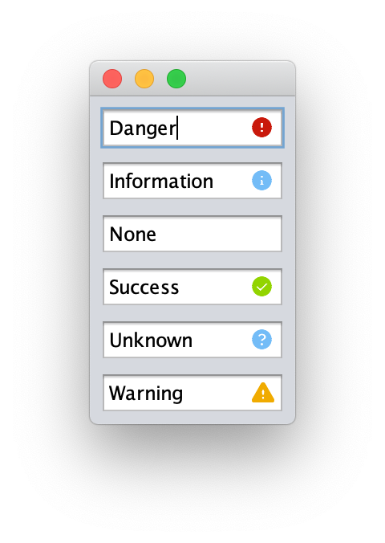

JInputValidator
===============

An [InputVerifier](https://docs.oracle.com/javase/8/docs/api/index.html?javax/swing/InputVerifier.html) for Java Swing that shows validation state to the right of the validating component.

[](https://maven-badges.herokuapp.com/maven-central/com.alexandriasoftware.swing/jinputvalidator)
[](https://www.javadoc.io/doc/com.alexandriasoftware.swing/jinputvalidator)
[](https://travis-ci.com/rhwood/jinputvalidator)
[](https://coveralls.io/github/rhwood/jinputvalidator?branch=master)
[](https://codeclimate.com/github/rhwood/jinputvalidator/maintainability)
[](https://codeclimate.com/github/rhwood/jinputvalidator/test_coverage)

JInputValidator extends the verify idiom to use six states, each with its own graphical representation and tool tip text:

- __DANGER__, a failure state, which defaults to a red letter _X_ in a circle.
- __INFORMATION__, a non-failure state, which defaults to a light blue letter _i_ in a circle.
- __NONE__, the default state, which does not show any icon.
- __SUCCESS__, a non-failure state, which defaults to a green check mark in a circle.
- __UNKNOWN__, a non-failure state, which defaults to a light blue question mark in a circle.
- __WARNING__, a failure state, which defaults to a yellow-orange exclamtion mark in a triangle.



## Usage

Simple example that shows a Danger indicator if an input is less than 8 characters:

```java
myJTextField.setInputVerifier(new JInputValidator(myJTextField, true) {
            @Override
            protected Validation getValidation(JComponent input, JInputValidatorPreferences preferences) {
                if (myJTextField.getText().length < 8) {
                    return new Validation(Validation.Type.DANGER, "Too short");
                }
                return new Validation(Validation.Type.NONE, "");
            }
        });
```

You can also use existing verifiers with the `JInputValidator` subclass `VerifyingValidator`:

```java
myJTextField.setInputVerifier(new InputVerifer() {
    @Override
    public boolean verify(JComponent input) {
        return (myJTextField.getText().length >= 8);
    }
})
myJTextField.setInputVerifier(new VerifyingValidator(myJTextField, myJTextField.getInputVerifier(), new Validation(Validation.Type.DANGER, "Too short")));
```